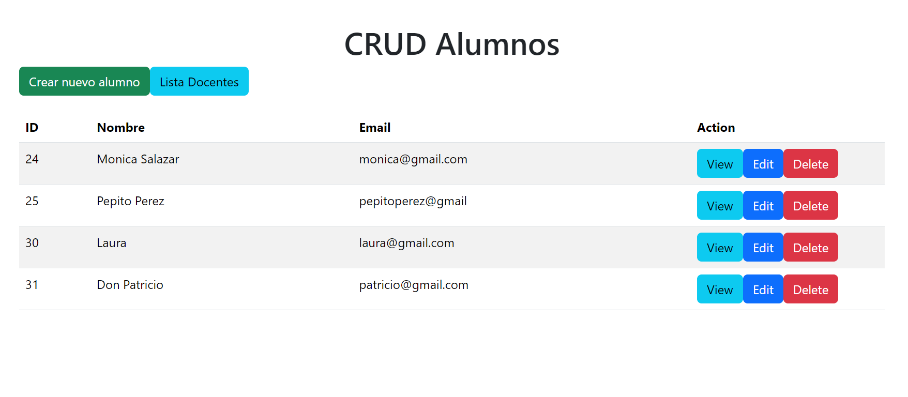
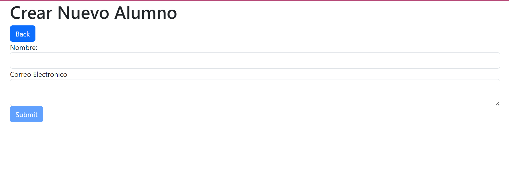
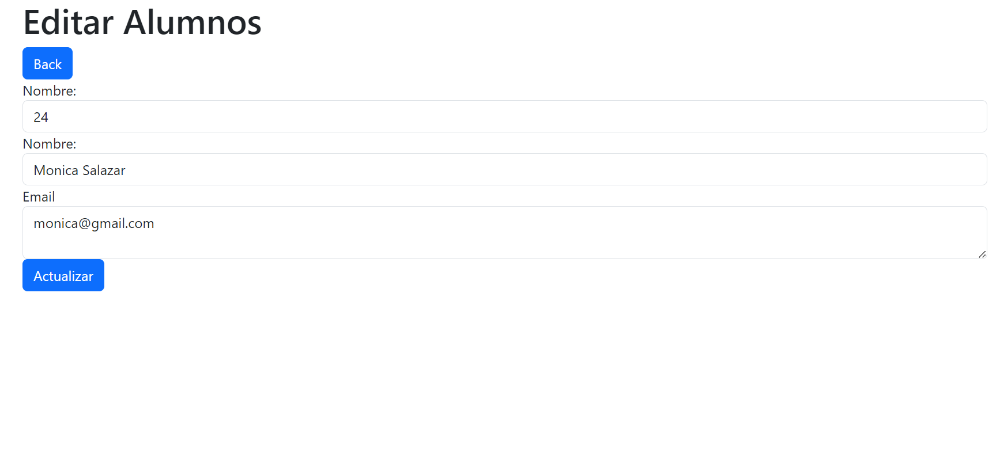
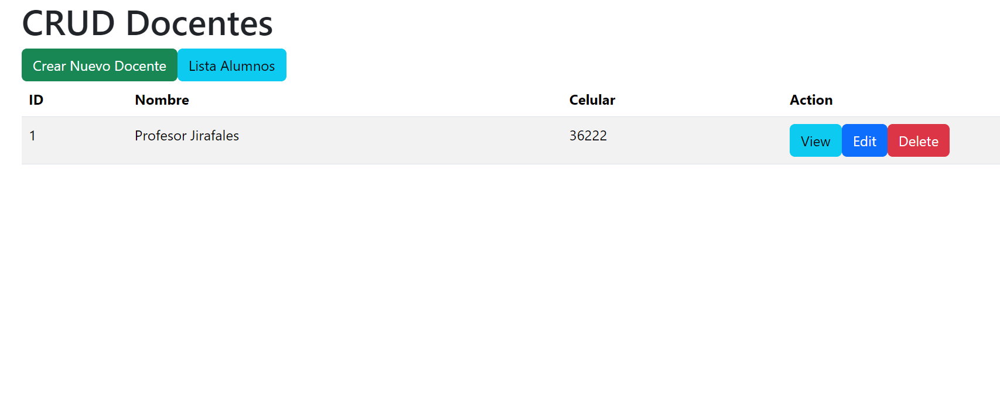

<h1>Sistema CRUD con Angular y Spring Boot</h1>
Este proyecto es una aplicación web de gestión que utiliza Angular para el frontend y Spring Boot para el backend. Permite realizar operaciones CRUD (Crear, Leer, Actualizar, Eliminar) en dos entidades: Alumnos y Docentes.

Características
Frontend con Angular: La interfaz de usuario está construida utilizando Angular, proporcionando una experiencia de usuario moderna e interactiva.

Backend con Spring Boot: El servidor backend está desarrollado con Spring Boot, facilitando la creación de API RESTful y la interacción con una base de datos.

Operaciones CRUD: La aplicación permite realizar operaciones básicas de CRUD para gestionar tanto la información de los alumnos como la de los docentes.

Tecnologías Utilizadas
Angular: Un potente framework de desarrollo de aplicaciones web basado en TypeScript.

Spring Boot: Un framework de desarrollo de aplicaciones Java para la creación de servicios web y APIs RESTful de manera eficiente.

TypeScript: Un lenguaje de programación tipado que se compila a JavaScript, utilizado para el desarrollo del frontend.

Java: Lenguaje de programación utilizado en el backend.

